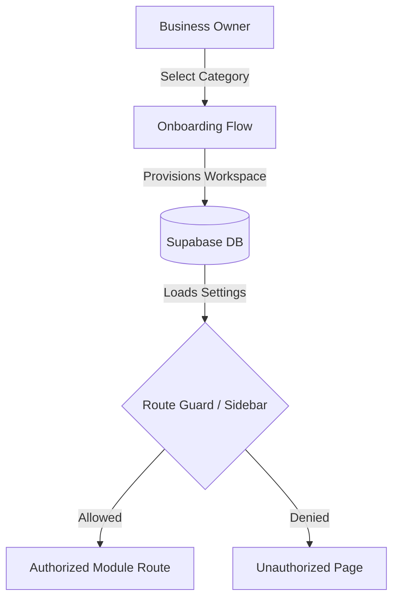

# MeuQR — System Architecture

This document describes the core architecture of the MeuQR platform, transitioning it to a multi-vertical, scoped SaaS platform.

## 1. Monorepo Structure

MeuQR is managed as a monorepo with `pnpm` workspaces:

* **`apps/web`**: Next.js App Router workspace representing the business dashboard (`/dashboard/business/[id]`), landing/marketing pages, public QR pages (`/[businessSlug]`), and public APIs.
* **`apps/mobile`**: React Native (Expo Router) mobile app designed specifically for business owners to monitor operations, scan QR codes, and see requests in real time.
* **`packages/shared`**: Holds shared logic, types, Zod validation schemas, translations, verticals configurations, and plan limits.
* **`packages/ui`**: Shared UI component library containing reusable inputs, buttons, card wrappers, and theme styles.
* **`packages/supabase`**: Database client configuration and typings generated directly from the remote database schema.

---

## 2. Multi-Vertical Isolation & Modules Guard

MeuQR restricts the features displayed to each business according to its vertical category.

### Module Route Guard

Access to sub-routes under `/dashboard/business/[id]/[moduleSlug]` is evaluated client-side in the dashboard layout:
1. Extract the active route slug.
2. Translate the route slug to its shared module key.
3. Call `isModuleEnabled(business.category, moduleKey)`.
4. If unauthorized, redirect to the `/unauthorized` sub-path to present a clean warning.

---

## 3. Provisioning & Template Seeding

During onboarding, the system calls `/api/onboarding/setup`. This endpoint:
1. Creates the `businesses` record.
2. Automatically inserts the default page and active sections in the `sections` table.
3. Seeds mock items (products or services) matching the business category from `packages/shared/src/verticals.ts` so the customer has a working setup on day one.
4. Activates default module associations.
