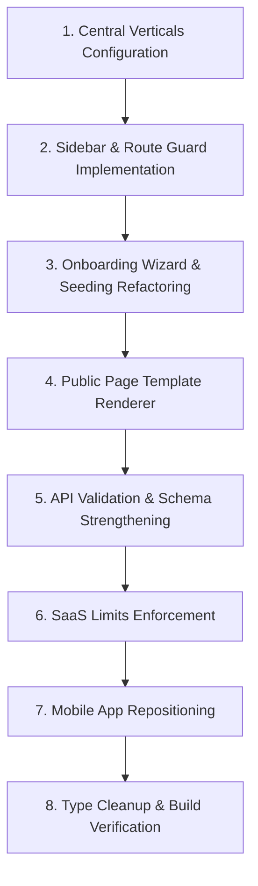

# MeuQR — Transition to Multi-Vertical SaaS: Implementation Audit

This document summarizes the current architecture of the MeuQR project, highlights detected issues, and outlines a step-by-step roadmap to transform it from a generic QR listing app into a highly polished, multi-vertical SaaS platform for Brazilian small businesses.

---

## 1. Current Architecture Summary

The MeuQR project is structured as a Monorepo using `pnpm` workspaces:

* **`apps/web`**: Next.js 16 Web Application utilizing the App Router. The management console operates under a Multi-Tenant "Business OS" architecture scoped to `/dashboard/business/[id]/` routes, where `id` refers to the active business UUID.
* **`apps/mobile`**: React Native (Expo) app for business owners (Owner Quick App) with dashboard stats, QR scanning, customer orders, and quotes.
* **`packages/shared`**: Holds shared validation schemas (using Zod), typescript type definitions, database helper utilities, and multi-language translation files.
* **`packages/ui`**: Component library housing shared design components (buttons, input fields, cards).
* **`packages/supabase`** / **`supabase/`**: Contains database schema definitions, row-level security (RLS) policies, and migrations.

### Dynamic Navigation Concept
* **`packages/shared/src/business-os/navigation.ts`**: Currently determines the sidebar list via a skeleton function `getNavigationForBusiness(...)` that checks enabled modules against `VERTICAL_CONFIGS`.
* **`packages/shared/src/business-os/onboarding.ts`**: Defines a list of 11 verticals (Health, Beauty, Food, Construction, Retail, Automotive, Real Estate, Hotels, Education, Professional Services, Events) and subvertical categories.

---

## 2. Detected Problems & Vulnerabilities

Through an analysis of the codebase, several architectural and design vulnerabilities have been identified:

### A. Overloaded Business Management Console
* **Feature Bloat**: There are currently **45 separate route subdirectories** under `apps/web/src/app/(dashboard)/dashboard/business/[id]/` (such as `/concierge`, `/vehicles`, `/courses`, `/loyalty`). Many of these are empty placeholders or highly niche features.
* **Lack of Route Guards**: There is no active permission check or route guard at the page level. If a user manually inputs `/dashboard/business/[id]/courses` for a *Construction Shop*, the page will load successfully even though the module is not relevant to that business.

### B. Onboarding Friction & Missing Customization
* **Generic Setup**: The current onboarding wizard does not ask vertical-specific questions (such as table count for restaurants, delivery zones for construction stores, or appointment hours for clinics).
* **No Sample Data Seeding**: When a business is created, it lacks default categories, items, and placeholder sections corresponding to its business category. This forces non-technical users to build their pages from scratch.

### C. Type Safety & Code Duplication
* **Inline Casting**: Several routes cast the database response inline (using `biz = business as unknown as { ... }` in `apps/web/src/app/[businessSlug]/page.tsx` and sub-pages) rather than relying on typed DTOs or shared interfaces.
* **Loose Types**: There are multiple uses of `any` types across the dashboard pages, complicating editor integrations and increasing compilation risks.

### D. Public API Vulnerabilities
* **Validation Gaps**: Endpoints like `/api/orders`, `/api/quote-requests`, and `/api/leads` perform database inserts without strict validation of the payload structure.
* **No Module Availability Checks**: A customer can submit an order to a business that doesn't have the `orders` module enabled in the database, potentially corrupting transaction histories.
* **Bypass of Limits**: Free tier limits (e.g. limit of 10 items) are only verified client-side, allowing malicious users to bypass limits by POSTing directly to the REST API.

---

## 3. Recommended Roadmap & Safe Implementation Order

To ensure a seamless, non-breaking refactoring process, the transition should be executed in the following order:

### Phase 1: Core SaaS Scoping (Steps 2 - 3)
1. **Define Verticals Config**: Create `packages/shared/src/verticals.ts` detailing allowed/hidden modules, menu configurations, and onboarding questions.
2. **Sidebar Refactoring**: Modify the dashboard navigation to read the active business's category, showing only allowed modules.
3. **Module Route Guards**: Implement a global or layout-level route guard in Next.js to prevent users from typing URLs of disabled modules.
4. **Clean up Active Modules**: Set feature flags in `packages/shared/src/featureFlags.ts` to hide non-essential MVP modules (`concierge`, `courses`, `vehicles`, `advanced CRM`).

### Phase 2: User Experience & Seeding (Steps 4 - 5)
5. **Interactive Onboarding**: Update `/onboarding/page.tsx` to ask customized questions per vertical.
6. **Smart Template Seeding**: Build helper functions to auto-provision default sections and products (e.g. "Cimento CP-II" for construction, "Corte de Cabelo" for beauty) so the workspace is immediately usable.
7. **Refactor Public Renderer**: Update the public menu component (`client.tsx`) to dynamically hide/render blocks (hero, products, quotes, appointments) based on the business's active vertical.

### Phase 3: Hardening & Compliance (Steps 6 - 12)
8. **Secure Public APIs**: Implement shared Zod schemas. Add phone formatting validation, payload size constraints, active business checks, and rate-limiting.
9. **SaaS Limit Enforcement**: Add middleware or API-level checks to verify resource counts against active plans (Free vs. Premium).
10. **Type Safety Pass**: Remove `any` types from shared logic and replace database inline casting with common models.
11. **Mobile Owner App Update**: Trim down mobile app routes to keep the mobile interface focused on notifications, orders, quotes, and quick scanner actions.

### Phase 4: Verification (Steps 13 - 15)
12. **Audit Documentation**: Compile unified guides for routing, security, and schema changes.
13. **Typecheck & Build**: Validate all workspaces via `pnpm typecheck` and `pnpm build`.
